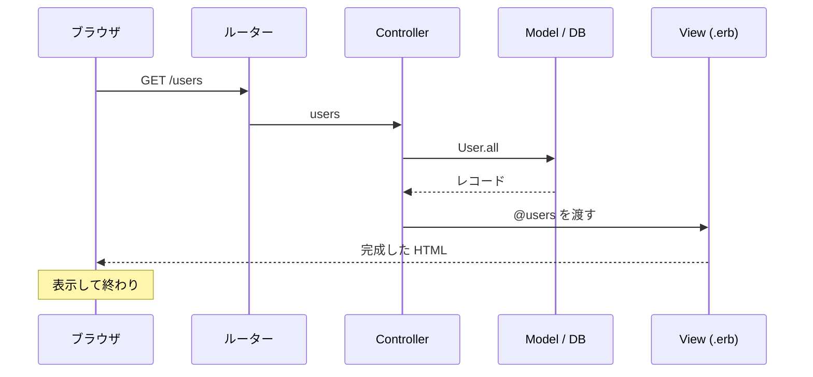
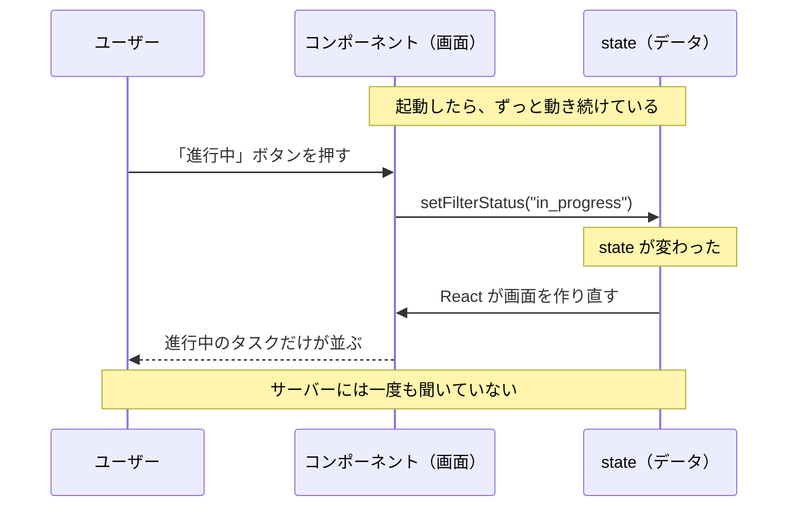
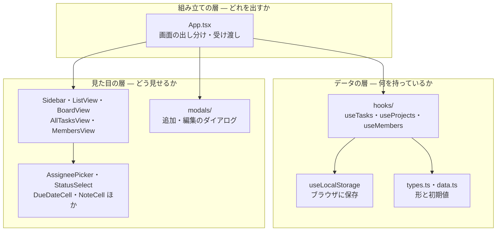
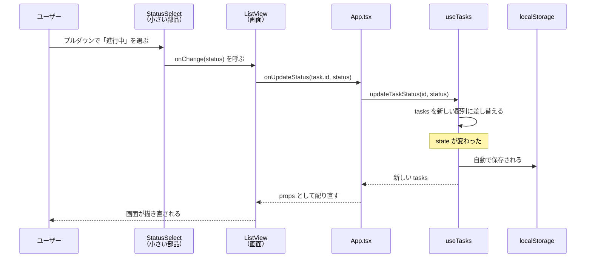
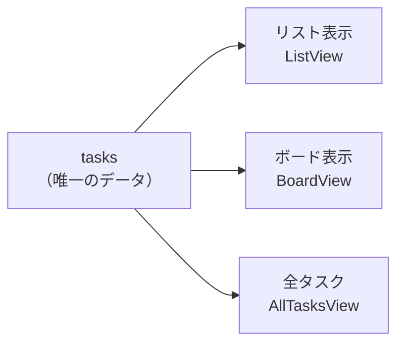

# 02. 全体像

用語の意味は [01-用語集.md](01-用語集.md) にある。分からない語が出たら戻る。

---

## Rails の MVC と、何が違うのか

Rails を触ったことがあると、まずここでつまずく。
**このアプリに Controller はないし、URL もない。**

### Rails のかたち



**1回のリクエストで、始まって終わる。**
次に何かするときは、また最初からやり直す。

### このアプリのかたち



**サーバーへの往復がない。** ブラウザの中で完結している。

### 対応表

| Rails | このアプリ | ファイル |
| --- | --- | --- |
| DB（テーブル） | localStorage ＋ メモリ上の配列 | `hooks/useLocalStorage.ts` |
| `schema.rb`（列の定義） | 型定義 | `types.ts` |
| `seeds.rb`（初期データ） | 初期データ | `data.ts` |
| Model（`User`） | カスタムフック | `hooks/useTasks.ts` ほか |
| Controller のアクション | フックの中の関数（`updateTask`） | 同上 |
| View（`.erb`） | コンポーネント | `components/*.tsx` |
| パーシャル（`_form`） | 小さいコンポーネント | `components/StatusSelect.tsx` ほか |
| ルーティング（URL） | **なし**。`activeNav` という state | `App.tsx` |
| Asset Pipeline | Vite | `vite.config.ts` |

### いちばん大きな違い

Rails は **「リクエストが来る → 作る → 返す → 終わり」**。
React は **「起動する → state が変わるたび描き直す → ずっと続く」**。

だから React には、Rails でいう Controller にあたる
「入り口で交通整理をする場所」が要らない。
代わりに中心にあるのは、この一行に尽きる。

> ### 画面は、state から計算した結果でしかない。

「ボタンを押したら、この要素を書き換える」とは書かない。
「ボタンを押したら、state をこう変える」とだけ書く。
画面をどう直すかは React が引き受ける。

---

## 起動してから画面が出るまで

```
index.html            ← 空の <div id="root"></div> があるだけ
  └ src/main.tsx      ← その箱に App を差し込む（3行しかない）
      └ App.tsx       ← 全体を組み立てる
```

`index.html` の中身は本当にこれだけ。

```html
<div id="root"></div>
<script type="module" src="/src/main.tsx"></script>
```

`main.tsx` がその空箱に `<App />` を入れ、そこから先はすべて JavaScript が作る。

**ページを移動しても、この HTML は読み込み直されない。**
「メンバー」画面に切り替わるのは、`activeNav` という state が
`"members"` に変わって、表示するコンポーネントが差し替わっているだけ。

---

## 3つの層に分かれている



| 層 | 役割 | 知らなくていいこと |
| --- | --- | --- |
| データの層 | タスクを持ち、追加・更新する | **どう表示されるか** |
| 組み立ての層 | どの画面を出すか決め、値を配る | 各画面の中身の詳細 |
| 見た目の層 | 受け取った値を表示する | **どこに保存されるか** |

この分け方の狙いは1つ。

> **保存先を localStorage から DB に変えても、見た目の層は1行も変わらない。**

`ListView` は「タスクの配列をもらって並べる」しか知らない。
それが localStorage から来ようと Supabase から来ようと関係がない。

---

## データの流れ（一方向）

タスクのステータスを「進行中」に変えたとき、何が起きるか。



ポイントは2つ。

**1. 部品は自分でデータを書き換えない**

`StatusSelect` はタスクの配列を知らないし、触れない。
「選ばれました」と親に伝えるだけ。実際に書き換えるのは `useTasks` だけ。

これは Rails でいえば、
ビューが直接 SQL を書かず、モデル経由でしか更新しないのと同じ考え方。
**書き換える場所が1つしかないので、追いかけるのが楽になる。**

**2. データは「差し替える」もので、「書き換える」ものではない**

```tsx
// ✗ 元の配列を直接いじる（React が変化に気づかない）
tasks[0].status = "done";

// ○ 新しい配列を作って差し替える
setTasks(prev => prev.map(t => t.id === id ? { ...t, status } : t));
```

React は「前と別のものになったか」で描き直すかを判断している。
中身をこっそり書き換えると、**同じ配列のまま**なので気づいてもらえない。

`{ ...t, status }` は「t の中身を全部コピーして、status だけ新しくしたもの」。
このコピーを作る書き方（スプレッド構文）は React では毎日使う。

---

## 3つの画面が同じデータを見ている

このアプリで一番効いている設計がこれ。



同じタスクを3か所から編集できる。
リストで担当者を変えれば、ボードにも全タスクにも即座に反映される。

**データを持っている場所が1つしかないので、食い違いようがない。**

もし3つの画面がそれぞれ自分のコピーを持っていたら、
「リストでは田中さん、ボードでは佐藤さん」という状態が簡単に起きる。

同じ理由で、**表示部品も1つに統一してある**。
担当者を選ぶドロップダウンは、以前は3画面に別々にコピペされていた。
1つにまとめたので、直すのも1か所で済む。

---

## ファイルの地図

```
Asana Clone for Task Management/
├── index.html                   空の箱があるだけ
├── src/
│   ├── main.tsx                 箱に App を差し込む（3行）
│   └── app/
│       ├── App.tsx              全体の組み立て・画面の出し分け（265行）
│       ├── types.ts             データの形（Task / Project / Member）
│       ├── data.ts              初期データと定数（seeds に相当）
│       ├── constants.ts         列幅などの数値
│       ├── navigation.ts        画面の種類の型
│       │
│       ├── hooks/               ── データの層 ──
│       │   ├── useLocalStorage.ts  ブラウザへの保存
│       │   ├── useTasks.ts         タスクの取得と更新
│       │   ├── useProjects.ts      プロジェクト
│       │   ├── useMembers.ts       メンバー
│       │   └── useSidebarResize.ts サイドバーの幅
│       │
│       └── components/          ── 見た目の層 ──
│           ├── Sidebar.tsx         左のナビ
│           ├── ListView.tsx        リスト表示
│           ├── BoardView.tsx       ボード表示
│           ├── AllTasksView.tsx    全タスク横断
│           ├── MembersView.tsx     メンバー一覧
│           │
│           ├── AssigneePicker.tsx  担当者を選ぶ（3画面で共用）
│           ├── StatusSelect.tsx    ステータスのプルダウン
│           ├── DueDateCell.tsx     期日とカレンダー
│           ├── EditableTaskName.tsx タスク名のインライン編集
│           ├── NoteCell.tsx        備考欄
│           ├── Avatar.tsx          アイコン
│           ├── Modal.tsx           ダイアログの共通の枠
│           │
│           ├── modals/             追加・編集のダイアログ5つ
│           └── ui/                 shadcn/ui（既製品。ほぼ触っていない）
│
├── 学習メモ/                     このフォルダ
└── package.json
```

`components/ui/` は既製の部品集（shadcn/ui）で、
Figma Make が最初から入れたもの。**自分で書いたコードではない**ので、
読むときは飛ばしてよい。

---

## この構造になった経緯

最初からこうだったわけではない。
Figma Make が出力した時点では、**`App.tsx` に全部が入った 1,649行**だった。
型もデータも画面も、1つのファイルに同居していた。

分けた理由は「長いから」ではなく、

> **どこを変えると、どこが壊れるか分からなかったから。**

いま `265行` になり、変更したい場所をファイル名から探せるようになった。

その分割で何を基準に判断したかは、
`03-状態の置き場所.md` と `04-画面を分ける.md` に書く予定（未作成）。

---

## 次に読む

- 言葉が分からなくなったら → [01-用語集.md](01-用語集.md)
- state をどこに置くか → 03-状態の置き場所.md（未作成）
