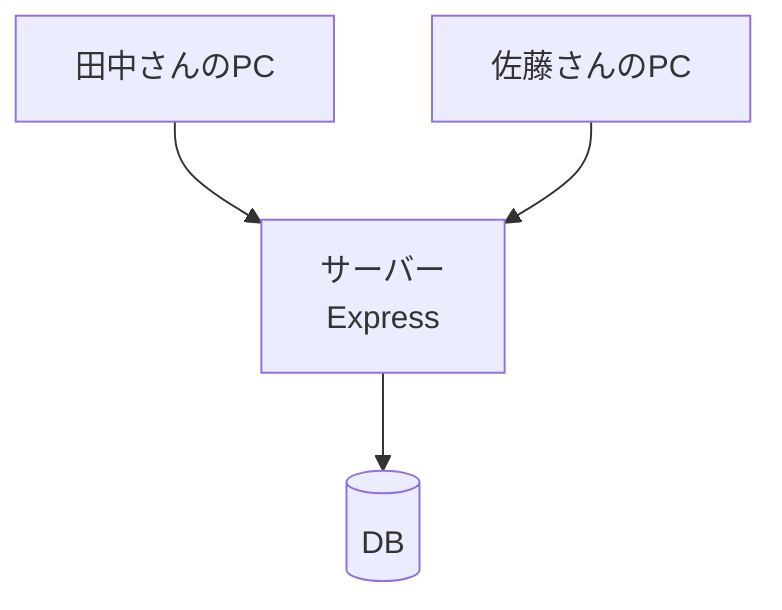
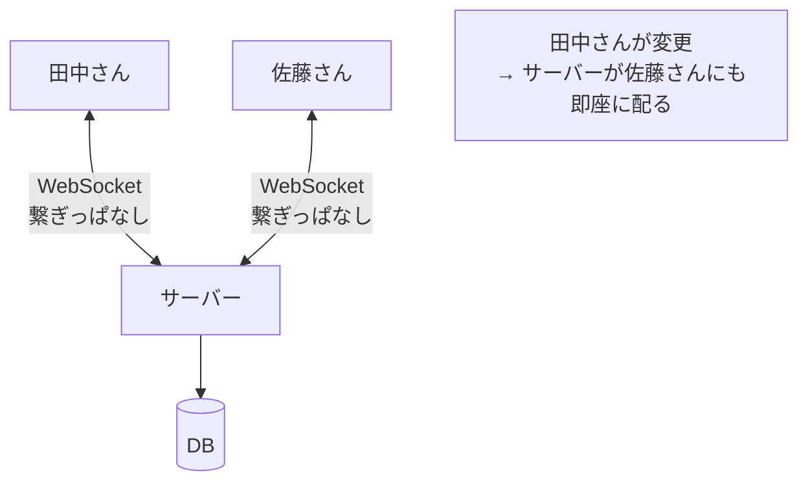
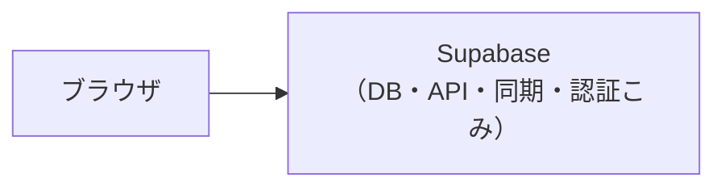
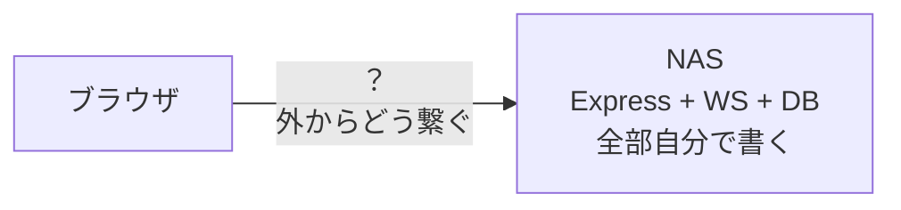

# 06. サーバーと DB の話

いまこのアプリは、データを **localStorage**（ブラウザの中）に保存している。
これを「みんなで共有できる」形にするには、何が要るのか。

用語は [01-用語集.md](01-用語集.md) にある。分からない語が出たら戻る。

---

## いまの状態：サーバーがない


- データはブラウザの中だけにある
- 別のPCで開くと、別のデータになる
- 他の人とは共有できない

「Web制作の案件を、チームで管理する」には、この時点で足りない。
**保存する場所を、みんなが見に行ける1か所にまとめる**必要がある。

---

## ブラウザは DB に直接つなげない

まず勘違いしやすいところ。

「NAS に DB を置いて、そこにブラウザから保存すればいいのでは？」
→ **できない。** 理由が2つある。

### 理由1：そもそも言葉が通じない

ブラウザが話せるのは基本 HTTP（と WebSocket）だけ。
DB（PostgreSQL や MariaDB）は HTTP ではない独自の言葉で話す。
ブラウザにはその言葉を喋る機能が積まれていない。

### 理由2：パスワードが丸見えになる

仮に繋げたとしても、DB のパスワードを
**フロントエンドのコードに書くことになる**。

フロントエンドの JavaScript は、ブラウザに届いた時点で誰でも読める。
DevTools を開けばそのまま見える。

> オセロで学んだ「権威サーバー」と同じ話。
> クライアント（ブラウザ）は信用しない。
> 大事なもの（パスワード、判定ロジック）はサーバー側に置く。

つまり、ブラウザと DB の間には**必ず仲介役が要る**。

---

## だから間に「サーバー」を挟む


この「仲介役」がやること：

- ブラウザから HTTP でお願いを受ける
- DB のパスワードを**自分だけ**が持っていて、DB と話す
- 結果をブラウザに返す

パスワードはサーバーの中だけにあり、ブラウザには一度も渡らない。

---

## Express の役割

**Express は、この HTTP の受け付け係。**

Rails でいうと、**ルーティングと Controller の入り口だけ**を抜き出したもの。
Model も View も持っていない（そこは自分で書く）。

実は、オセロで既に使っている。`server/src/index.js` の冒頭に、
自分でこう書いていた。

```
// HTTP: ビルド済みのクライアントを配信する
// WebSocket: 対戦のやりとり（JSONメッセージ）
```

オセロで Express が実際にやっているのは、この3つだけ。

```js
app.get("/healthz", ...)              // 死活確認
app.use(express.static(CLIENT_DIR))   // ビルド済みファイルを配る
app.get("*", ...)                     // SPAなので全部 index.html を返す
```

タスク管理でこれに足すのは「データを読み書きする窓口」。

```js
app.get("/tasks", ...)        // タスク一覧をDBから読んで返す
app.post("/tasks", ...)       // 新しいタスクをDBに書く
app.patch("/tasks/:id", ...)  // タスクを更新する
```

この一つ一つの窓口を **API（エンドポイント）** と呼ぶ。
ブラウザは DB を直接見ず、この窓口越しにやりとりする。

---

## ここまでで「保存と共有」はできる（同期はまだ）

Express + DB だけで、こうなる。



- データが1か所（DB）に集まる
- 田中さんが保存 → 佐藤さんが**リロードすれば**見える
- 別のPCから開いても同じデータが出る

**ただし「リロードすれば」。** 佐藤さんの画面は、
田中さんが変えた瞬間には変わらない。開き直して初めて最新になる。

人数が少なくて、同時に同じ画面を触らないなら、これで十分実用になる。

---

## リアルタイム同期には WebSocket が要る

「田中さんが変えた瞬間、佐藤さんの画面にも出る」をやるには、
サーバーの側から**勝手に**佐藤さんに話しかける必要がある。

HTTP ではこれができない。オセロのメモに書いた通り。

> HTTP = 手紙。1回お願いして、1回返事が来て、そこで切れる。
> サーバーから勝手に話しかけられない。
>
> WebSocket = 電話をかけっぱなし。
> 最初に繋いだら回線を開いたままにする。どちらからでも喋れる。

これもオセロで書いている。Express が作った HTTP サーバーに、
WebSocket が**相乗り**する形。

```js
const wss = new WebSocketServer({ server: server, path: "/ws" });
```

同じポート（同じ番号）を共有できるのは、
最初の接続が HTTP で始まり、途中で WebSocket に切り替わるから
（＝ハンドシェイク）。



これはオセロの `broadcastState(room)`
（着手があったら部屋の全員に盤面を配る）とまったく同じ発想。

---

## オセロにあって、このアプリにない武器：手番

ここが一番大事な違い。**リアルタイム同期にすると、新しい問題が出る。**

オセロには **手番** があった。
`server/src/room.js` の `play()` に、5つの関門のうちの1つとして
「③ その人の手番か」があった。

手番があるおかげで、**2人が同時に盤面を変えることがルール上ありえない**。
だから全員に同じ盤面を配れば、必ず一致した。
**衝突という概念が存在しなかった。**

タスク管理には手番がない。だから、こういうことが起きる。

- 田中さんと佐藤さんが**同時に**同じタスクの担当者を変えたら、どっちが勝つ？
- リストを開いたまま放置 → その間に他の人が消したタスクを編集したら？
- 備考欄を2人が同時に打っていたら、片方の入力は消えていい？

オセロを守っていた仕組みが、こちらには無い。

> 「離れた2台の画面を食い違わせない」という**同じ問題**を、
> **手番という武器なしで**解くことになる。

これは Express や DB の使い方の話ではなく、**設計の判断**。
一番シンプルなのは「後から書いた人が勝つ（last write wins）」。
多くの小さなツールはこれで割り切っている。まずはそれで十分なことが多い。

---

## 自前で作る場合と、Supabase を使う場合

保存先の選択肢は2つある。

### A. Supabase を使う

Supabase は「DB ＋ API ＋ リアルタイム ＋ 認証」がセットになったサービス。



- **Express も WebSocket も書かない。** 上の配管が全部用意されている
- 「他の人が変えた」の即時配信は Supabase Realtime が担当する
- 外部公開の問題も起きない（最初からネット上にある）
- 残る判断は「手番のない衝突をどうするか」だけ

### B. Synology NAS で自前

NAS の中に DB とサーバーを自分で立てる。



- Express + WebSocket + DB を全部自分で書いて運用する
- データが手元にある。費用は電気代だけ
- **一番の壁は DB でも Express でもなく「外からどう繋ぐか」**
  - NAS は LAN の中にいるので、社外や自宅からは見えない
  - VPN / QuickConnect / DDNS＋ポート開放 / Tailscale などが要る
  - ポート開放は攻撃対象になる
  - HTTPS の証明書も要る（`https` のページから `ws://` は繋げない、
    というオセロで踏んだ話がここでも効く）
  - NAS が落ちていたらアプリが使えない

オセロで Render を借りたのは、まさにこの
「常時起動していて外から見える場所」が要るから。
NAS はそれを自前でやる選択。

### 「オセロの延長」はどこまで本当か

NAS 自前は「オセロの延長」と言えるが、**中身は3つに分かれる**。

| | 内容 | オセロから |
| --- | --- | --- |
| 足回り | express.static、SPAフォールバック、ping、再接続、wss切替、try/catch | **そのまま流用できる** |
| 中身 | メッセージの種類、broadcast の単位 | 形は同じ、中身は別物（room.js は捨てる） |
| 新しい山 | **DB**（オセロはメモリのMapだけだった）と**手番のない衝突** | **未経験。ここが本番** |

足回りは確かに延長。でも DB と衝突設計は新しい山。
「延長だから軽い」わけではない。

---

## 現実的な進め方

WebSocket を最初から入れる必要はない。
オセロで「HTTP と WebSocket は同じサーバーに同居できる」と
分かっているので、**後から足せる**。

```
第1段階  保存できる・共有できる（同期はまだ）
         → Express + DB だけ（Supabase なら書かなくていい）
         → 別の端末から見られる。リロードで最新が取れる
         → 少人数なら、これで実用になる

第2段階  リアルタイム同期
         → WebSocket を足す（Supabase なら Realtime を使う）
         → ここで初めて「手番のない衝突」の設計が要る
```

第1段階なら、自前でも新しく学ぶのは実質 **DB だけ**。
Express はオセロからの流用で済む。

そして [05-保存のしくみ.md](05-保存のしくみ.md)（未作成）に書くが、
保存先を差し替える口（`useTasks` などのフック）は既に用意してある。
どちらを選んでも、画面側のコードはほぼ変わらない。

---

## この章の要点

- ブラウザは DB に直接つなげない（言葉が通じない・パスワードが漏れる）
- だから間にサーバーを挟む。その HTTP 受付係が **Express**
- Express + DB で「保存・共有」はできる（リロードが要る）
- 「即座に反映」には **WebSocket** が要る（サーバーから話しかける）
- オセロには**手番**があって衝突が起きなかった。**このアプリには無い**
- 自前 NAS はオセロの足回りを流用できるが、**DB と衝突設計は新しい山**
- WebSocket は後から足せる。まず「保存・共有」から始めてよい

---

## 次に読む

- 保存先を差し替える口の作り方 → 05-保存のしくみ.md（未作成）
- 用語の確認 → [01-用語集.md](01-用語集.md)
